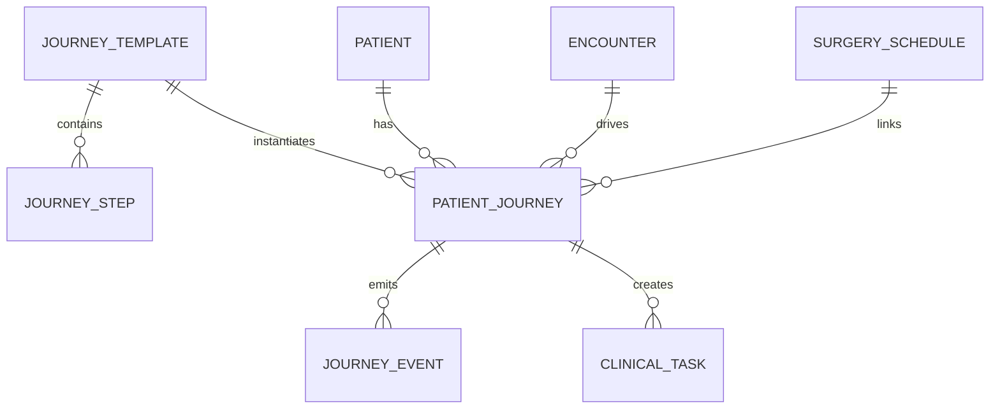
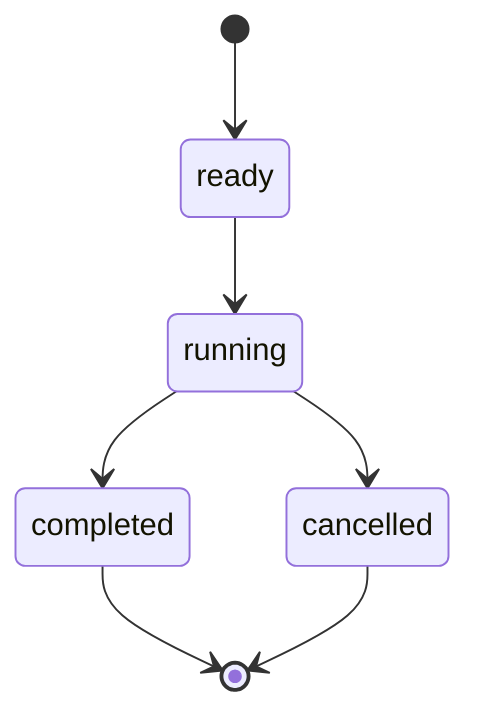

# Patient Journey 数据模型

版本：0.1  
日期：2026-05-16

## 1. 模型关系



## 2. JourneyTemplate

旅程模板定义一类病人的完整业务路径。

| 字段 | 说明 |
| --- | --- |
| templateId | 模板 ID |
| templateCode | 模板编码 |
| templateName | 模板名称 |
| diseaseName | 病种名称 |
| departmentId | 默认科室 |
| description | 模板说明 |
| steps | 步骤数组 |
| enabled | 是否启用 |

第一阶段内置：

```text
TPL_CHOLECYSTECTOMY_INPATIENT
胆囊结石择期住院手术流程
```

## 3. JourneyStep

步骤是旅程模板里的可执行节点。

| 字段 | 说明 |
| --- | --- |
| stepCode | 步骤编码 |
| stepName | 步骤名称 |
| phase | 阶段：入院、术前、术中、术后、出院 |
| defaultOffsetMinutes | 相对上一步默认间隔 |
| linkedAction | 执行动作，例如 `updateSurgeryStatus`、`createDocument` |
| interfaceEvent | 对外事件编码 |
| description | 说明 |

## 4. PatientJourney

旅程实例绑定具体虚拟病人、就诊和手术。

| 字段 | 说明 |
| --- | --- |
| journeyId | 旅程 ID |
| templateId | 模板 ID |
| patientId | 患者 ID |
| encounterId | 就诊 ID |
| surgeryScheduleId | 手术排班 ID，可选 |
| status | ready、running、completed、cancelled |
| currentStepIndex | 当前步骤下标，未开始为 -1 |
| startedTime | 开始时间 |
| updatedTime | 更新时间 |
| finishedTime | 完成时间 |
| simulatedTime | 当前仿真时间 |
| summary | 当前摘要 |

## 5. JourneyEvent

时间线事件是旅程最重要的输出。

| 字段 | 说明 |
| --- | --- |
| eventId | 事件 ID |
| journeyId | 旅程 ID |
| stepCode | 步骤编码 |
| stepName | 步骤名称 |
| phase | 阶段 |
| eventTime | 事件发生时间 |
| actor | 模拟执行人或系统 |
| sourceSystem | SmartHIS、Scenario、SmartOR 等 |
| interfaceEvent | 对外事件编码 |
| description | 时间线显示文本 |
| payload | 关联对象和扩展数据 |

## 6. ClinicalTask

临床任务用于表达“还没完成的业务动作”，第一阶段可以先做轻量模型。

| 字段 | 说明 |
| --- | --- |
| taskId | 任务 ID |
| journeyId | 旅程 ID |
| taskType | 检查、检验、文书、手术、护理、出院 |
| taskName | 任务名称 |
| status | pending、completed、cancelled |
| ownerDeptId | 所属科室 |
| dueTime | 计划时间 |
| completedTime | 完成时间 |
| linkedObjectType | 关联对象类型 |
| linkedObjectId | 关联对象 ID |

## 7. 状态机

### 旅程状态



### 旅程阶段

```text
入院 -> 术前 -> 术中 -> 术后 -> 出院
```

### 与已有模型的关系

Patient Journey 不替代现有模型，而是驱动现有模型：

- 入院步骤驱动 `Patient`、`Encounter`、`Admission`。
- 检查检验步骤驱动 `Order`、`LabReport`、`ExamReport`、`ImagingStudy`。
- 文书步骤驱动 `Document`。
- 手术步骤驱动 `SurgeryRequest`、`SurgerySchedule`、`SurgeryEvent`。
- 出院步骤驱动 `Admission`、`Encounter`、`Bed`。
- 所有步骤都写入 `InterfaceMessage`。

## 8. 第一阶段 API

```http
GET  /api/v1/journey-templates
GET  /api/v1/journey-templates/{templateId}
GET  /api/v1/patient-journeys
GET  /api/v1/patient-journeys/{journeyId}
POST /api/v1/patient-journeys
POST /api/v1/patient-journeys/{journeyId}/next
POST /api/v1/patient-journeys/{journeyId}/run
GET  /api/v1/patient-journeys/{journeyId}/timeline
```

## 9. MVP 数据约束

- 第一阶段旅程数据仍放在内存种子数据里。
- 服务重启后恢复默认演示旅程。
- 旅程事件可以反复重置。
- 后续接 PostgreSQL 时，把 `patientJourneys`、`journeyEvents`、`clinicalTasks` 作为独立表。
