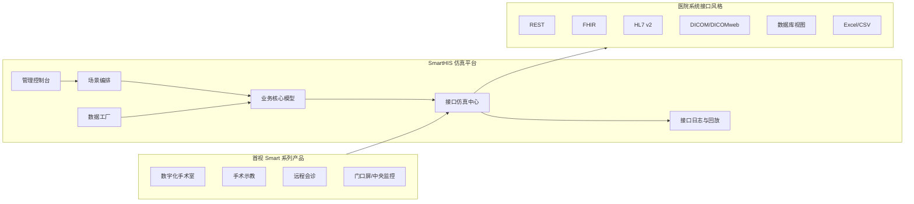

# SmartHIS 产品蓝图

版本：0.1  
日期：2026-05-16  
定位：面向首视 Smart 系列软件的医院业务与接口仿真平台

## 1. 产品定位

SmartHIS 不是替代真实医院 HIS 的生产系统，而是一个“小而全、可配置、可演示、可联调”的医院信息化仿真平台。

它的核心目标是：

- 为数字化手术室、手术示教、远程会诊、家属谈话、门口屏、中央监控、一键清洁等首视 Smart 系列产品提供稳定的医院业务环境。
- 模拟中国医院常见系统，包括 HIS、EMR、LIS、RIS、PACS、手麻系统、集成平台、手术排班系统等。
- 提供通用假数据、标准接口、异常场景、项目模板，支撑研发、测试、演示、培训、交付前验收。
- 逐步产品化，面向同类行业客户提供“医院信息系统仿真器”和“医疗项目接口测试底座”。

## 2. 目标用户

| 用户类型 | 典型诉求 | SmartHIS 价值 |
| --- | --- | --- |
| 首视研发团队 | 没有真实医院系统可长期联调 | 本地可复现的 HIS/EMR/PACS 等模拟环境 |
| 项目交付团队 | 项目前期接口条件不完整 | 用标准模拟接口提前验证业务流程 |
| 售前演示团队 | 需要完整医院业务链路演示 | 一键生成演示医院、演示患者、演示手术 |
| 测试团队 | 需要稳定测试数据和异常接口 | 场景编排、数据重置、接口日志与回放 |
| 行业客户 | 缺少医院系统联调资源 | 可私有部署的医疗接口仿真产品 |

## 3. 产品边界

### 3.1 包含内容

- 中国医院组织结构模拟：院区、科室、病区、手术部、手术间、床位、人员。
- 患者与就诊模拟：患者主索引、门诊、住院、诊断、医嘱、费用基础信息。
- 手术业务模拟：手术申请、排班、台次、麻醉、入室、手术开始、手术结束、出室。
- 医疗文书模拟：入院记录、术前小结、手术记录、出院小结、会诊记录。
- 检查检验模拟：检验申请、样本、报告；检查申请、报告、影像索引。
- PACS/DICOM 模拟：DICOM 样例、检查号、影像调阅链接、DICOMweb 基础接口。
- 接口仿真：REST、FHIR、HL7 v2、DICOM/DICOMweb、Webhook、数据库视图、文件导入导出。
- 场景工厂：生成医院、科室、人员、患者、住院、手术、报告、文书、异常流程。
- 管理控制台：数据管理、接口配置、消息日志、场景执行、模拟医院切换。

### 3.2 不包含内容

- 不用于真实诊疗、真实收费、真实医保结算或真实病历归档。
- 不存储真实患者隐私数据。
- 不以通过医院评级测评为第一目标，只参考相关标准建立合理模型。
- 第一阶段不做完整 EMR 编辑器、完整 PACS 归档系统、完整药房库存系统。

## 4. 产品模块

### 4.1 SmartHIS Core

核心业务数据服务，提供医院基础数据、患者、就诊、住院、医嘱、诊断、手术、报告、文书等内部模型。

### 4.2 SmartHIS Interface Hub

接口仿真与适配中心，负责向外提供不同医院常见接口风格：

- REST API：适合首视产品快速对接。
- FHIR API：适合标准化资源输出。
- HL7 v2：适合模拟传统医院集成平台消息。
- DICOM/DICOMweb：适合 PACS 与影像调阅场景。
- Webhook：适合手术状态、报告完成、会诊状态等事件推送。
- DB View：适合模拟现场只给数据库视图的项目情况。

### 4.3 SmartHIS Scenario

场景编排引擎，支持一键生成或推进业务流程：

- 普通住院手术流程。
- 急诊手术流程。
- 日间手术流程。
- 妇产/妇幼手术流程。
- 多学科远程会诊流程。
- 手术示教直播流程。
- 一键清洁与手术间周转流程。
- 异常场景：患者撤台、手术延期、报告撤回、接口超时、编码缺失。

### 4.4 SmartHIS Data Factory

中国医院通用假数据生成器：

- 医院模板：三甲综合医院、妇幼医院、县级医院、专科医院。
- 数据模板：科室、病区、手术间、人员、患者、诊断、手术、检查、检验、费用项目。
- 数据重置：支持按医院模板恢复初始数据。
- 数据脱敏：导入客户样例后只保留结构，不保留真实身份。

### 4.5 SmartHIS Console

面向研发、测试、交付、售前的管理界面：

- 医院模板管理。
- 患者与手术数据浏览。
- 场景启动与推进。
- 接口开关与映射配置。
- 接口日志、消息回放、错误注入。
- 首视产品对接状态看板。

## 5. 首视产品对接场景

| 场景 | SmartHIS 提供能力 | 首视产品侧用途 |
| --- | --- | --- |
| 数字化手术室 | 手术排班、患者信息、术中状态、文书摘要、影像报告 | 术间工作站、手术看板、数据采集 |
| 手术示教 | 手术台次、术者、示教授权、影像资料、直播场景 | 直播预约、示教课表、录播归档 |
| 远程会诊 | 会诊申请、病历摘要、检查检验、影像索引、会诊记录 | 会诊发起、资料同步、结果回写 |
| 家属谈话 | 患者信息、谈话预约、术前资料、签署状态 | 谈话安排、资料展示、状态同步 |
| 门口屏 | 手术间、台次、患者脱敏信息、术中状态 | 门口显示、状态刷新 |
| 中央监控 | 多手术间状态、视频源、手术进度、告警 | 手术部总览、运行监控 |
| 一键清洁 | 出室事件、手术间状态、清洁派单、清洁完成 | 手术间周转、保洁流程联动 |

## 6. 推荐总体架构

## 7. 第一阶段 MVP

第一阶段目标是先跑通“手术业务主链路”，不追求完整医院系统。

### 7.1 必须完成

- 医院基础字典：机构、院区、科室、病区、床位、手术间、人员。
- 患者主索引：患者、门诊号、住院号、证件号样式、联系方式、医保类型。
- 住院业务：入院、转科、床位、诊断、出院状态。
- 手术业务：手术申请、手术排班、台次、麻醉、术者、护士、手术状态流转。
- 文书摘要：术前小结、手术记录、出院小结。
- 检查检验报告：报告列表、详情、异常标记、状态。
- 影像索引：检查号、影像 study、报告、调阅地址。
- 对外接口：REST、FHIR 基础资源、HL7 v2 主要消息、PACS 调阅模拟。
- 管理控制台：数据浏览、场景推进、接口日志。

### 7.2 暂缓完成

- 完整电子病历编辑器。
- 医保结算。
- 药房库存。
- 真实 DICOM 长期归档。
- 医院评级测评规则全覆盖。
- 多租户商业授权系统。

## 8. 产品化路线

| 阶段 | 时间建议 | 目标 |
| --- | --- | --- |
| Phase 1: Core MVP | 4-6 周 | 跑通首视手术相关产品联调主链路 |
| Phase 2: Scenario | 2-3 个月 | 加入场景编排、数据工厂、异常接口、项目模板 |
| Phase 3: Product | 3-6 个月 | 打包部署、授权、接口文档、SDK、演示包、交付工具 |
| Phase 4: Ecosystem | 6 个月以上 | 面向行业客户，支持插件、第三方接口适配、私有化交付 |

## 9. 成功标准

第一阶段完成时，应满足：

- 一台开发电脑可以启动完整 SmartHIS 仿真环境。
- 首视数字化手术室产品能从 SmartHIS 获取患者、住院、手术排班、检查检验、文书摘要。
- SmartHIS 能模拟手术状态从申请到出室的完整流程。
- 接口日志能清楚显示每次调用、每条消息、返回结果和错误。
- 售前可以用一套演示数据完整演示手术业务链路。
- 测试可以重置数据并重复执行同一测试场景。

## 10. 合规与安全原则

- 默认只使用假数据，不导入真实患者身份信息。
- 如需导入客户样例，只做结构分析和脱敏，不用于产品演示数据。
- 产品界面和文档明确标注“用于模拟、联调、演示、测试，不用于真实诊疗”。
- 接口凭证、私钥、客户地址等敏感信息不得写入演示包。
- 日志保留请求响应结构，但默认脱敏身份证号、电话、姓名等个人信息。
