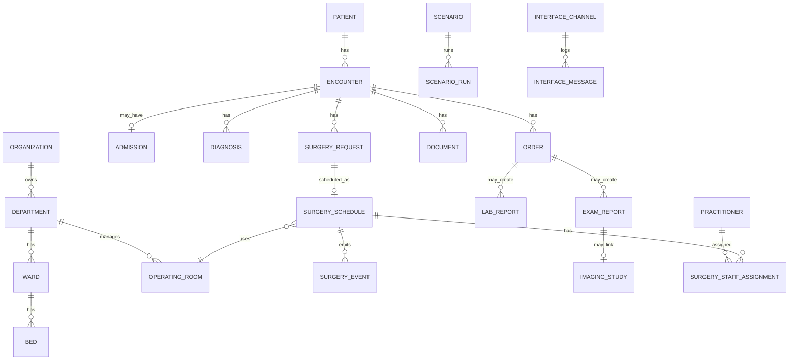
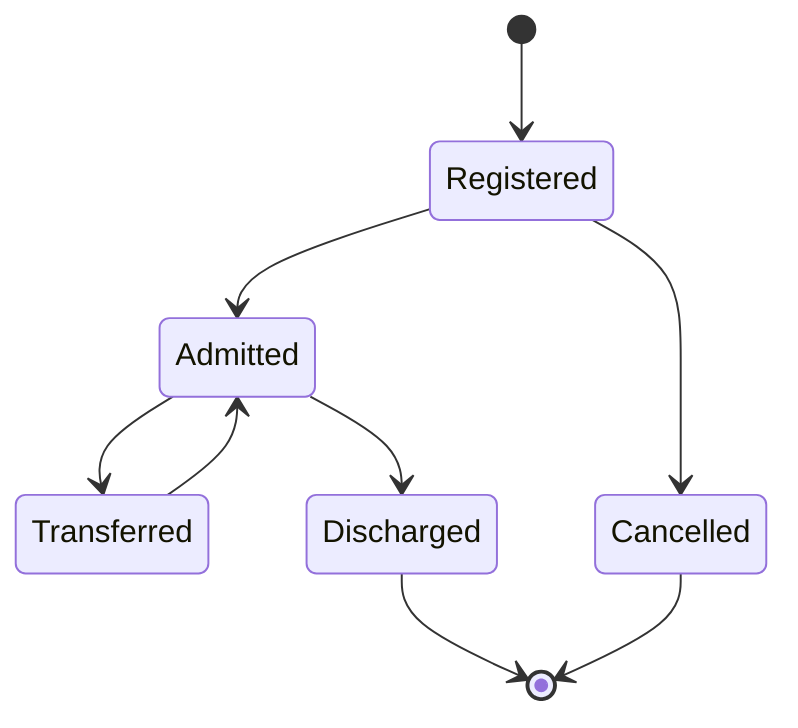
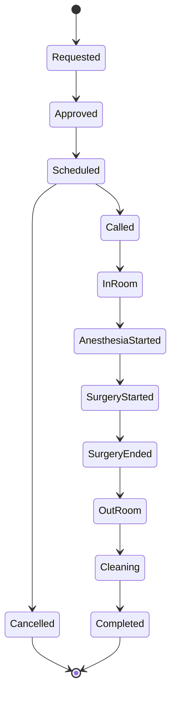
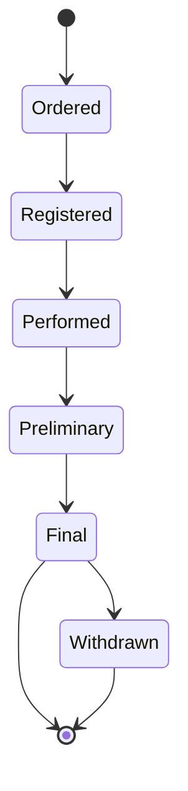

# SmartHIS 数据模型设计

版本：0.1  
日期：2026-05-16  
目标：建立一个适合中国医院信息化场景、又便于首视 Smart 系列产品联调的简化核心模型

## 1. 设计原则

- 内部模型保持简洁，不照搬真实医院复杂度。
- 外部接口可以映射成 HIS、EMR、LIS、RIS、PACS、手麻、集成平台等不同系统风格。
- 所有业务数据默认是假数据，字段结构尽量贴近中国医院项目现场。
- 手术相关数据优先，因为数字化手术室、手术示教、远程会诊是第一阶段核心场景。
- 编码体系可配置，不在第一阶段追求全国标准全量覆盖。

## 2. 核心域模型

## 3. 基础主数据

### 3.1 Organization 医疗机构

| 字段 | 说明 |
| --- | --- |
| org_id | 机构唯一编号 |
| org_code | 医院编码 |
| org_name | 医院名称 |
| org_type | 综合医院、妇幼医院、专科医院、县级医院等 |
| grade | 二级、三级、三甲等 |
| region_code | 行政区划编码 |
| address | 地址 |
| enabled | 是否启用 |

### 3.2 Campus 院区

| 字段 | 说明 |
| --- | --- |
| campus_id | 院区编号 |
| org_id | 所属机构 |
| campus_name | 院区名称 |
| address | 院区地址 |

### 3.3 Department 科室

| 字段 | 说明 |
| --- | --- |
| dept_id | 科室编号 |
| dept_code | 科室编码 |
| dept_name | 科室名称 |
| dept_type | 门诊、住院、医技、手术、行政等 |
| parent_dept_id | 上级科室 |
| campus_id | 所属院区 |
| enabled | 是否启用 |

建议第一批内置科室：

- 麻醉科、手术室、普外科、骨科、妇科、产科、泌尿外科、胸外科、神经外科、心内科、ICU、急诊科、影像科、检验科、病理科。

### 3.4 Ward 病区与 Bed 床位

| 模型 | 关键字段 |
| --- | --- |
| Ward | ward_id、ward_code、ward_name、dept_id、floor、nurse_station |
| Bed | bed_id、bed_no、ward_id、room_no、status、current_encounter_id |

### 3.5 OperatingRoom 手术间

| 字段 | 说明 |
| --- | --- |
| room_id | 手术间编号 |
| room_code | 手术间编码 |
| room_name | 手术间名称，例如 OR-01、复合手术间 |
| room_type | 普通、百级、复合、日间、急诊 |
| dept_id | 所属手术部 |
| floor | 楼层 |
| status | 空闲、占用、清洁中、停用 |
| video_source_code | 模拟视频源编码 |

### 3.6 Practitioner 医护人员

| 字段 | 说明 |
| --- | --- |
| practitioner_id | 人员编号 |
| staff_no | 工号 |
| name | 姓名 |
| gender | 性别 |
| title | 职称 |
| role | 医生、护士、麻醉医生、技师、管理员等 |
| dept_id | 所属科室 |
| phone | 模拟手机号 |
| enabled | 是否启用 |

## 4. 患者与就诊模型

### 4.1 Patient 患者主索引

| 字段 | 说明 |
| --- | --- |
| patient_id | 内部患者 ID |
| mpi_no | 主索引号 |
| name | 假姓名 |
| gender | 性别 |
| birth_date | 出生日期 |
| age_text | 年龄显示，例如 45岁、3月 |
| id_card_no | 假身份证号 |
| phone | 假手机号 |
| address | 假地址 |
| insurance_type | 城镇职工、城乡居民、自费、商业保险等 |
| blood_type | ABO/Rh |
| allergy_text | 过敏史摘要 |

### 4.2 Encounter 就诊

| 字段 | 说明 |
| --- | --- |
| encounter_id | 就诊 ID |
| patient_id | 患者 ID |
| encounter_type | 门诊、急诊、住院、体检 |
| outpatient_no | 门诊号 |
| inpatient_no | 住院号 |
| visit_no | 就诊流水号 |
| dept_id | 当前科室 |
| attending_doctor_id | 主治医生 |
| status | 挂号、就诊中、住院中、已出院、取消 |
| start_time | 就诊开始时间 |
| end_time | 就诊结束时间 |

### 4.3 Admission 住院

| 字段 | 说明 |
| --- | --- |
| admission_id | 住院记录 ID |
| encounter_id | 就诊 ID |
| ward_id | 病区 |
| bed_id | 床位 |
| admission_time | 入院时间 |
| discharge_time | 出院时间 |
| admission_diagnosis | 入院诊断 |
| discharge_diagnosis | 出院诊断 |
| nursing_level | 护理级别 |
| condition_level | 病情等级 |

### 4.4 Diagnosis 诊断

| 字段 | 说明 |
| --- | --- |
| diagnosis_id | 诊断 ID |
| encounter_id | 就诊 ID |
| diagnosis_code | ICD-10 或本地编码 |
| diagnosis_name | 诊断名称 |
| diagnosis_type | 入院、出院、术前、术后、主要、次要 |
| is_primary | 是否主诊断 |
| recorded_time | 记录时间 |

## 5. 医嘱与报告模型

### 5.1 Order 医嘱/申请单

| 字段 | 说明 |
| --- | --- |
| order_id | 医嘱 ID |
| order_no | 医嘱号 |
| encounter_id | 就诊 ID |
| order_type | 检验、检查、手术、用药、护理、会诊 |
| item_code | 项目编码 |
| item_name | 项目名称 |
| status | 开立、确认、执行中、已完成、取消 |
| requester_dept_id | 申请科室 |
| requester_id | 申请医生 |
| requested_time | 申请时间 |
| scheduled_time | 计划执行时间 |

### 5.2 LabReport 检验报告

| 字段 | 说明 |
| --- | --- |
| lab_report_id | 检验报告 ID |
| order_id | 关联医嘱 |
| sample_no | 样本号 |
| specimen_type | 血液、尿液、组织等 |
| report_name | 报告名称 |
| status | 采样、检验中、已审核、已撤回 |
| report_time | 报告时间 |
| abnormal_flag | 正常、偏高、偏低、危急 |
| items_json | 检验明细 |

### 5.3 ExamReport 检查报告

| 字段 | 说明 |
| --- | --- |
| exam_report_id | 检查报告 ID |
| order_id | 关联医嘱 |
| accession_no | 检查号 |
| modality | CT、MR、DX、US、ES、XA 等 |
| body_part | 检查部位 |
| finding | 所见 |
| conclusion | 结论 |
| status | 已登记、已检查、已审核、已撤回 |
| report_time | 报告时间 |

### 5.4 ImagingStudy 影像索引

| 字段 | 说明 |
| --- | --- |
| imaging_study_id | 影像索引 ID |
| accession_no | 检查号 |
| study_instance_uid | DICOM StudyInstanceUID |
| patient_id | 患者 ID |
| encounter_id | 就诊 ID |
| modality | 影像类型 |
| study_time | 检查时间 |
| dicomweb_url | DICOMweb 访问地址 |
| viewer_url | Web 调阅地址 |

## 6. 手术业务模型

### 6.1 SurgeryRequest 手术申请

| 字段 | 说明 |
| --- | --- |
| surgery_request_id | 手术申请 ID |
| surgery_no | 手术申请号 |
| encounter_id | 就诊 ID |
| order_id | 关联手术医嘱 |
| planned_surgery_code | 手术编码，可映射 ICD-9-CM-3 |
| planned_surgery_name | 拟施手术名称 |
| surgery_level | 手术级别 |
| incision_type | 切口类别 |
| anesthesia_method | 麻醉方式 |
| position | 手术体位 |
| isolation_flag | 是否隔离 |
| requested_time | 申请时间 |
| status | 已申请、已审核、已排班、已取消 |

### 6.2 SurgerySchedule 手术排班

| 字段 | 说明 |
| --- | --- |
| surgery_schedule_id | 排班 ID |
| surgery_request_id | 手术申请 ID |
| schedule_date | 手术日期 |
| room_id | 手术间 |
| table_no | 台次 |
| planned_start_time | 计划开始 |
| planned_end_time | 计划结束 |
| actual_start_time | 实际开始 |
| actual_end_time | 实际结束 |
| status | 已排班、接台、入室、麻醉开始、手术开始、手术结束、出室、清洁中、完成、取消 |

### 6.3 SurgeryStaffAssignment 手术人员

| 字段 | 说明 |
| --- | --- |
| assignment_id | 分配 ID |
| surgery_schedule_id | 排班 ID |
| practitioner_id | 人员 ID |
| role | 主刀、一助、二助、麻醉医生、器械护士、巡回护士、洗手护士 |
| sort_no | 排序 |

### 6.4 SurgeryEvent 手术事件

| 字段 | 说明 |
| --- | --- |
| event_id | 事件 ID |
| surgery_schedule_id | 排班 ID |
| event_type | 入室、麻醉开始、手术开始、手术结束、出室、清洁开始、清洁完成 |
| event_time | 事件时间 |
| operator_id | 操作人 |
| source_system | SmartHIS、手麻、数字化手术室、人工模拟 |
| payload_json | 扩展数据 |

## 7. EMR 文书模型

### 7.1 Document 文书

| 字段 | 说明 |
| --- | --- |
| document_id | 文书 ID |
| encounter_id | 就诊 ID |
| document_type | 入院记录、病程记录、术前小结、手术记录、出院小结、会诊记录 |
| title | 文书标题 |
| author_id | 作者 |
| dept_id | 科室 |
| status | 草稿、已提交、已审核、已归档 |
| created_time | 创建时间 |
| signed_time | 签名时间 |
| content_text | 结构化摘要文本 |
| content_json | 结构化字段 |

第一阶段只做摘要，不做完整富文本 EMR 编辑器。

## 8. 会诊与示教模型

### 8.1 Consultation 会诊

| 字段 | 说明 |
| --- | --- |
| consultation_id | 会诊 ID |
| encounter_id | 就诊 ID |
| surgery_schedule_id | 可选关联手术 |
| consultation_type | 院内、远程、MDT、术中 |
| requester_dept_id | 申请科室 |
| invited_dept_id | 受邀科室 |
| reason | 会诊原因 |
| status | 已申请、已确认、进行中、已完成、取消 |
| scheduled_time | 计划时间 |
| conclusion | 会诊意见 |

### 8.2 TeachingSession 示教

| 字段 | 说明 |
| --- | --- |
| teaching_session_id | 示教 ID |
| surgery_schedule_id | 关联手术 |
| title | 示教主题 |
| teacher_id | 主讲人 |
| status | 已预约、直播中、已结束、已归档 |
| start_time | 开始时间 |
| end_time | 结束时间 |
| stream_code | 模拟视频源 |
| recording_url | 模拟录播地址 |

## 9. 设备与首视终端模型

### 9.1 DeviceTerminal 终端设备

| 字段 | 说明 |
| --- | --- |
| device_id | 设备 ID |
| device_code | 设备编码 |
| device_name | 设备名称 |
| device_type | 术间工作站、门口屏、示教终端、中央监控屏、会诊终端 |
| room_id | 关联手术间 |
| ip_address | 模拟 IP |
| status | 在线、离线、维护 |

### 9.2 MediaSource 媒体源

| 字段 | 说明 |
| --- | --- |
| media_source_id | 媒体源 ID |
| source_code | 源编码 |
| source_type | RTSP、RTMP、WebRTC、文件 |
| room_id | 关联手术间 |
| display_name | 显示名称 |
| stream_url | 模拟流地址 |
| enabled | 是否启用 |

## 10. 接口与场景模型

### 10.1 InterfaceChannel 接口通道

| 字段 | 说明 |
| --- | --- |
| channel_id | 通道 ID |
| channel_code | 通道编码 |
| channel_type | REST、FHIR、HL7、DICOM、Webhook、DB_VIEW、FILE |
| direction | 入站、出站、双向 |
| enabled | 是否启用 |
| config_json | 通道配置 |

### 10.2 InterfaceMessage 接口消息日志

| 字段 | 说明 |
| --- | --- |
| message_id | 消息 ID |
| channel_id | 通道 ID |
| correlation_id | 链路 ID |
| message_type | ADT_A01、ORM_O01、ORU_R01、REST_PATIENT_QUERY 等 |
| direction | request、response、event |
| status | success、failed、timeout、ignored |
| request_body | 请求内容，默认脱敏 |
| response_body | 响应内容，默认脱敏 |
| error_message | 错误信息 |
| created_time | 创建时间 |

### 10.3 Scenario 场景模板

| 字段 | 说明 |
| --- | --- |
| scenario_id | 场景 ID |
| scenario_code | 场景编码 |
| scenario_name | 场景名称 |
| hospital_template | 医院模板 |
| description | 场景说明 |
| steps_json | 步骤定义 |
| enabled | 是否启用 |

### 10.4 ScenarioRun 场景运行

| 字段 | 说明 |
| --- | --- |
| run_id | 运行 ID |
| scenario_id | 场景 ID |
| status | waiting、running、paused、completed、failed |
| current_step | 当前步骤 |
| started_time | 开始时间 |
| finished_time | 结束时间 |
| output_json | 生成的数据索引 |

## 11. 常用状态流

### 11.1 住院状态

### 11.2 手术状态

### 11.3 报告状态

## 12. 编码与字典

第一阶段建议内置轻量字典，后续支持导入客户字典。

| 字典 | 说明 |
| --- | --- |
| gender | 男、女、未知 |
| encounter_type | 门诊、急诊、住院、体检 |
| insurance_type | 城镇职工、城乡居民、自费、商业保险 |
| dept_type | 门诊、住院、医技、手术、行政 |
| practitioner_role | 医生、护士、麻醉医生、技师、管理员 |
| surgery_role | 主刀、一助、二助、麻醉医生、器械护士、巡回护士 |
| anesthesia_method | 全麻、椎管内麻醉、局麻、神经阻滞、复合麻醉 |
| surgery_level | 一级、二级、三级、四级 |
| incision_type | I、II、III、IV |
| report_status | 已申请、已执行、已审核、已撤回 |
| modality | CT、MR、DX、US、ES、XA、OT |

## 13. 关键编号规则

| 编号 | 示例 | 用途 |
| --- | --- | --- |
| mpi_no | MPI202605160001 | 患者主索引 |
| outpatient_no | MZ202605160001 | 门诊号 |
| inpatient_no | ZY202605160001 | 住院号 |
| visit_no | VIS202605160001 | 就诊流水 |
| order_no | ORD202605160001 | 医嘱号 |
| surgery_no | OP202605160001 | 手术申请号 |
| accession_no | ACC202605160001 | 影像检查号 |
| sample_no | LAB202605160001 | 检验样本号 |
| study_instance_uid | 1.2.826... | DICOM Study UID |

## 14. 数据生成规则

- 患者姓名使用假姓名库，不使用真实客户名单。
- 身份证号、手机号按格式生成，但不对应真实个人。
- 医院、科室、人员可以使用演示模板名称，也可以导入客户提供的脱敏模板。
- 诊断和手术名称使用常见样例，例如胆囊结石、剖宫产、股骨骨折、阑尾炎、肺结节等。
- 每个演示患者至少生成一个完整业务链路：患者、住院、诊断、手术、报告、文书。
- 支持按场景重置数据，保证同一演示可重复。

## 15. 第一阶段数据库建议

第一阶段可以使用 PostgreSQL，按以下 schema 拆分：

| Schema | 内容 |
| --- | --- |
| master | 机构、科室、病区、床位、人员、字典 |
| clinical | 患者、就诊、住院、诊断、医嘱、文书 |
| surgery | 手术申请、排班、人员、事件 |
| report | 检验、检查、影像索引 |
| integration | 接口通道、接口消息、映射配置 |
| scenario | 场景模板、场景运行 |

对象存储用于 DICOM 样例、报告附件、录播样例、接口文件。
